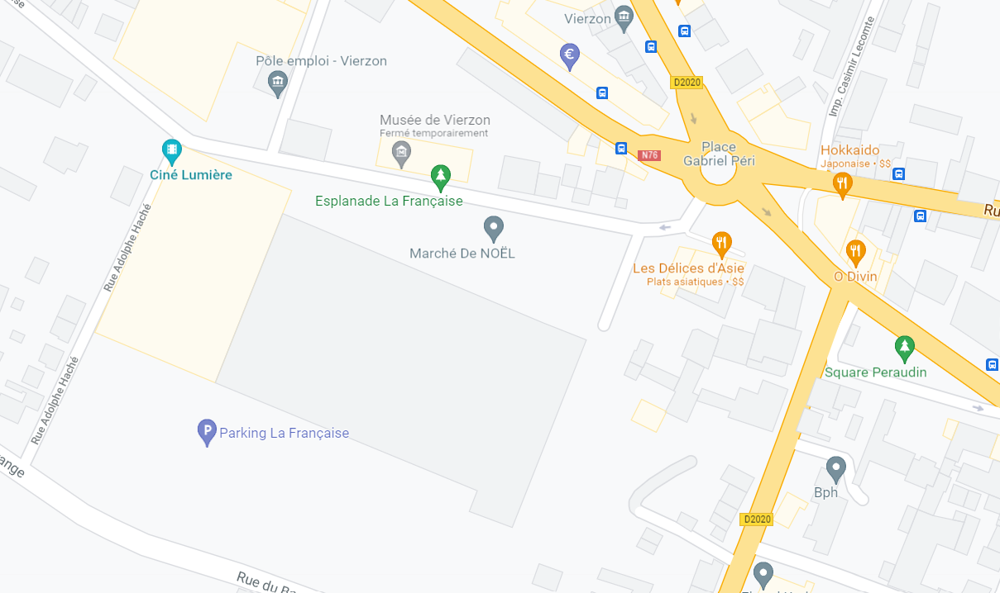
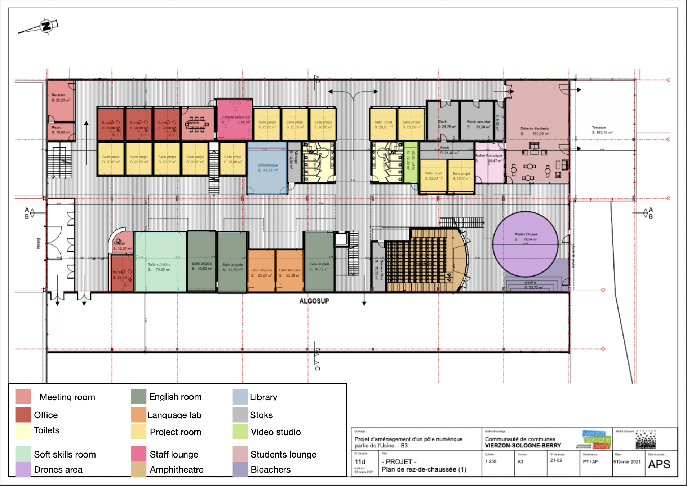
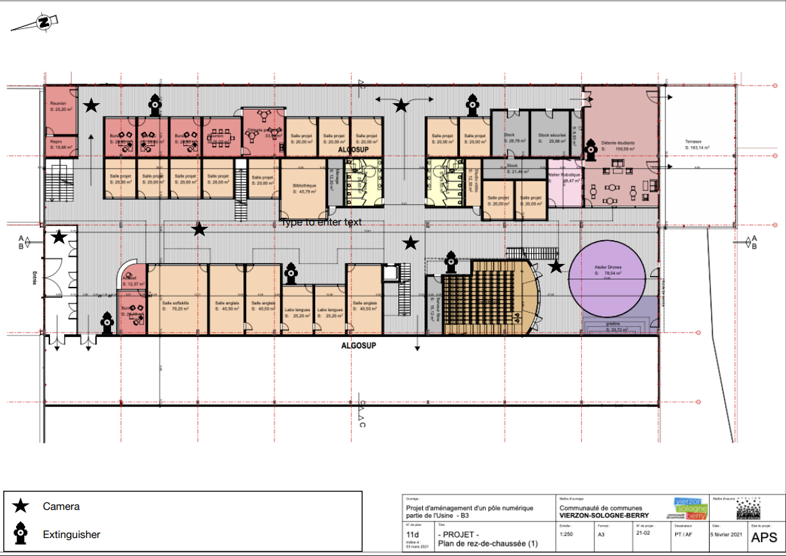
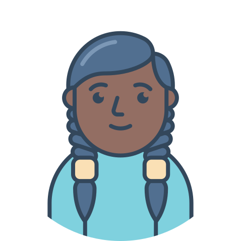
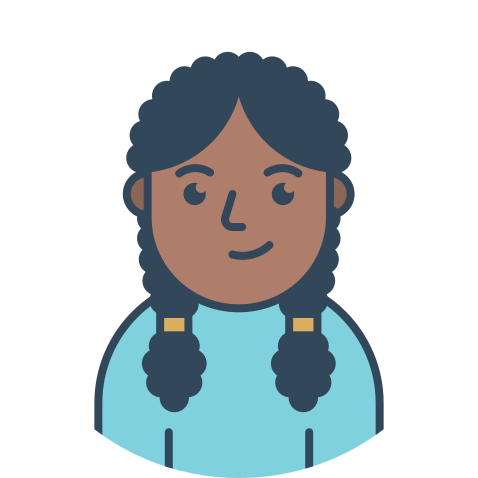

# Functional Specification

## Table of contents

-  [1. Introduction](#1-introduction)

-  [a. Why this project?](#a-why-this-project)

-  [b. Location](#b-location)

-  [2. Definitions of terms](#2-definitions-of-terms)

  

-  [3. Building content](#3-building-content)

-  [a. The goal](#a-the-goal)

-  [b. Rooms](#b-rooms)

-  [c. Layout](#c-layout)

-  [d. Handicap access](#d-handicap-access)

-  [e. Monitoring and security](#e-monitoring-and-security)

  

-  [4. Rooms content](#4-rooms-content)

-  [a. Furnitures](#a-furnitures)

-  [b. Connected equipment](#b-connected-equipment)

  

-  [5. Personae](#5-personae)

  

-  [6. User cases](#6-user-cases)

  
  
  
  

## 1. Introduction

  

### a. Why this project?

  
  

ALGOSUP will have a new building for 2023, with more space, more features than the current school.

  

To show what the school will look like, ALGOSUP needs a VR simulation of the new place. Our group will do create software that can simulate the exploration to the users of B3 as if they were there. To do this, we must add some realistic features, length, and height of the building, some furniture on the rooms, light, etc.

  

The users need some interaction on the simulation like system key/badge with a mobile application and can open the door with it.

The simulation must obey the laws of physics.

We don’t have any budget but we have to make realistic purchases.

### b. Location

  

The B3 is located at 16 Rue de la Société Française 18100 Vierzon.

  

## 2. Definitions of terms

  

**Virtual Reality** is an expression that designates the devices allowing them to digitally simulate an environment by the machine (computer). Depending on the technologies used, it allows the user to experience a virtual universe through their different senses: most often sight, but also touch, hearing and smell.

  

**B3** is the name of the building.

  

**CNAM** means Conservatory of Arts and Crafts, it is an institution dedicated to education, training, and research.

  

**AlgoShop** will be a stall placed on the corridor next to the reception. In this little shop, you will find derivative products of ALGOSUP like the ALGOSUP, AlgoSoap, t-shirts, ...

  

## 3. Building content

  

Here is the plan for the first floor of this B3.

  

  

### a. The goal

  

This building will welcome the four first promotions of students of ALGOSUP on the first floor.

On the second floor, the CNAM, the connected campus, and the incubator will be integrated.

The B3 will welcome 200 students in 2025 and 500 students in 2030.

We have chosen to decorate the B3 with an industrial design with wood to keep the style of the building.

  

### b. Rooms

  

All the walls are 3m high.

  

| Name |Utilisation|Number|Area|
| :--------------- |:---------------| :-----|:-|
|Reprography|This room will be used for printers. |1|10,68m²|
|Meeting room|These rooms will be used for appointments.|2|25,20m² & 25,00m²|
|Office|Workplace of the staff.|4|20,00m²|
|Reception|Welcome visitors and make appointments|1|12,37m²|
|Staff lounge|A place where the staff can eat and relax.|1|33,00m²|
|Student lounge|A place where the students can eat and relax.|1|150,59m²|
|Robotics workshop|In this room, you will find everything to build a robot|1|28,47m²|
|Stock|This room is for the stationery storage|2|21,46m² & 28,78m²|
|Secure stock|For the electronic storage|1|29,98m²|
|Technical area|The mechanical room. It's dedicated to electrical equipment|1|8,93m²|
|Housework stock|Store household product |1|12,30m²|
|Fiber sever|The place where the fiber server will be|1|15,12m²|
|Toilets|One toilet sanitary for women and one sanitary for men, with handicap access|2|29,65m²|
|Video studio|A room to film personal video, soundproof room|1|12,30m²|
|Project room|Room for 6 students on project time.|12|20,00m²|
|English room|Where the English class will take place.|3|40,50m²|
|Soft skills room|Where the soft skills class will take place.|1|70,20m²|
|Language lab|This room is for multiple students for their work in silence.|2|25,20m²|
|Amphitheatre|Where the computer science class will take place.|1|133,90m²|
|Library|The students can access it to borrow some books on programming and literature |1|45,79m²|

  

### c. Layout

  

| Name |Utilisation |Number|Area|
|:--------------- |:-----|:-|:-|
|Drone workshop|This surface is for drones test. it's delimited by a net.|1|78,64m²|
|Bleacher|To watch the drone workshop|1|33,72m²|
|Elevator|For people with disabilities to access the second floor|1||
|Stairs|To access the second floor|4||
|Doors|With different security access.|61||
|Letter box|A letterbox for each company |4|

  

On the corridors, you will find some column showcases with old or rare computers on them.

  

### d. Handicap access

  

People with disabilities can go from the parking behind to the building thanks to the elevator next to the stairs.

  

At the entrance, there are no stairs so, they can come easily. Similarly, there are disabled toilets in women's and men's toilets.

  

There is an elevator to access the second floor. This elevator will be accessible only to people with disabilities.

  

### e. Monitoring and security

  

#### Monitoring

  

For the monitoring, no video surveillance camera is planned for the moment, but if it's needed, we can place 5 cameras at strategic places.

  

#### Security

  

The security of the building will be with the Welcomr application.

  

| Hierarchy |Number of rooms access |Type of room access|
|:--------------- |:-----|:-|
|Open to Everyone|5|Toilets, Library, Reception, student lounge |
|Second-floor staff|6|Open to everyone, entrance|
|Students|23|Second-floor, project rooms, robots workshop, amphitheater, soft skills room, English room, language lab, drones workshop|
|Admin|31|Students, offices, meeting room, reprography, staff lounge, video studio|
|Admin ++|37|Admin, stocks|

  

Also for security, the building needs to have 12 fire extinguishers (6 on the first floor, and 6 on the second floor). To explain this, each fire extinguisher must be installed less than 1.20m from the ground, with a maximum spacing of 30m between two devices. Note that in the event of an identified risk, the fire extinguisher must be located less than 5m from it.

In addition, it will have an emergency exit sign.

  

  
  

## 4. Rooms content

  

Most of the supplies will be reused to recycle and have fewer purchases.

  

### a. Furnitures

  
  

In each room, there will have a bin, air conditioner, storage, small stationery, and lighting.

  
  

| Name |Furnitures|
|:--------------- |:---------------|
|Entrance/ Corridors|Carpet, plants, a box of masks, information panel, photo of the old building, Umbrella holder, AlgoShop |
|Reprography|paper, stapler, |
|Meeting room|tables, chairs, whiteboard, coat hanger, whiteboard|
|Office|desk, chairs,|
|Reception|chair, desk,|
|Staff lounge|sofa, chairs, tables, flatware, sink,|
|Student lounge|sofa, chairs, tables, flatware, poofs, sinks, carpets, |
|Robotics workshop|spare parts, tables, chairs, tools, whiteboard|
|Stock|fixed pat, scotch, paper, pen, markers, post it, erasable slate, whiteboard brush, staples, shelves, ink cartridges, power extension cord, |
|Secure stock|Shelves|
|Technical area||
|Housework stock| Cleaning products.|
|Fiber sever||
|Toilets|Toilets, sinks, toilet paper, hand-stitched, emergency kit, mirrors, pad dispenser, soap dispenser|
|Video studio|Chair, table|
|Project room|tables, chairs, whiteboard, whiteboard markers, whiteboard brush, software development projects, cubes|
|English room|tables, chairs, desk, whiteboard|
|Soft skills room|tables, chairs, desk, whiteboard|
|Language lab|chair, tables, the partition wall between each table |
|Amphitheatre|Tables, chairs, desk, Headset, Wireless handheld microphone, 1 or 2 projection screens, whiteboard|
|Library|chairs, tables, shelves, books, newpapers|

  
  

### b. Connected equipment

  

Next to each door, you will find a tablet with the reservation of the room.

Each door will have a connected lock that you can unlock with your Welcomr application.

Many electrical outlets will be in every room.

  
  

| Name |Furnitures|
|:--------------- |:---------------|
|Entrance / Corridors||
|Reprography|Scanners, printers|
|Meeting room||
|Office|Computers|
|Reception|Computer|
|Staff lounge|Microwaves, fridges, |
|Student lounge|Microwaves, fridges, food vending machine, hob, oven, coffee maker, kettle|
|Robotics workshop||
|Stock||
|Secure stock|VR headset, computers, HDMI cables, adaptors, computer mice, secure barrier, |
|Technical area||
|Housework stock||
|Fiber sever||
|Toilets|electric hand dryer|
|Video studio|Microphone, camera, light in front of the door|
|Project room|TV|
|English room|TV|
|Soft skills room|TV|
|Language lab||
|Amphitheatre|Projector, adjustment console, micro, TV|

  

## 5. Personae

  

Here are our 7 differents personae.

  

### Asha Allen

  

  

Asha is 28 years old, she spent 6 years in Paris, she were waitress on a restaurant and now moved to Bourges. She comes to Vierzon everyday by train.

She decided to change her profession to something different and new to her, Computer Science. She

heard about ALGOSUP from one of her loyal customer. So she looked up ALGOSUP on social medias like

Instagram and LinkedIn.

  

Asha is pacifist, but really distant from her family. She likes playing FIFA, and other video games

related to sports, but also likes NFT and cryptocurrencies. She hates touching grass due to the fact that she's allergic to it.

  

### Jade Pitron

  

  

Jade is 20 years old, she spent 3 months in math school in Tours, France.

She has decided to leave her school because she was afraid of her future, she needs to be reassured. She heard about ALGOSUP from Linkedin and Instagram. It follows that she wants to integrate ALGOSUP. She walks to school. 

  

Jade is close to her friends, her family. She shares her life on social media, she's very sociable, she listens to others.

  

In other words, Jade likes animals, like to spent time outside, and share everything on Instagram. She dislikes when she doesn't know where she's going, and talks in front of a lot of people.

  
  

### Liam Bert

  

  

Liam is 23 years old, he spent his last two years in a computer science preparatory school in Paris, France. He's passionate about computer science since he was a child and his favorite language is C++.

  

It was during his technological watch that he discovered ALGOSUP on Linkedin. He's active on social media. Liam wants to link his passion and his job. Liam is also very open-minded and goes straight to the point. He's a smoker. He's coming by his own car the morning.

  

Furthermore, he likes to go out with his friends, play video games, and manage a team. On the contrary, he dislikes the people that do nothing, and lose time.

  
  

### Tayson Schmitt

  

  

Tayson is a 19 years old student in ALGOSUP. He arrived from the U.S. one year ago after graduating from his high school. He has been in a wheelchair since an accident in his early childhood.

He came to France because his father lives here. He heard about ALGOSUP from some French friends and decided to join the school because he is very interested in Computer Science. His father drops him off every morning at the school and picks him up at the end of the day.

Moreover, he really likes dogs and also playing video games. He doesn’t really like classical music.

  
  

### Donovan Kart

  

  

Donovan is 17 years old, he's still in high school. Donovan has always been a curious, sporty and very sociable child. It's her mother who pushed him to visit school for the next years. He wants to develop his potential, open up himself, and exercise responsibilities. He knew ALGOSUP thanks to his mother.

Her mother drop him the morning and pick him up at the end of the day.

  

Besides, he likes video games, football, talk in public and on the other hand, he doesn't like authority.

  

### Lou and Liliane Kart

  

  

Lou is 36 years old and Liliane is 35 years old. There are the mothers of Donovan.

Lou is a commercial of a big company and Liliane is a teacher of history in high school. They lived in Bourges, this is why they know ALGOSUP. They are open minded, interested in computer science and they need to be reassured.

  

They want the best for their child, a structured school, which advances with the times.

  

### Mark Smith

  

  

Mark is 30 years old, he has create his own start-up in virtual reality 2 years ago. Mark is trilingual and has works for 3 years in the United states. He has known ALGOSUP because he was following Eric Larchevêque.

  

In other words, Mark is passionate by computer science, programming, and by his family.

He's the father of a baby, and wants to inculcate of true value to his son. He's generous and passionate, this is why gives some classes to students that are curious, is rewarding for him.

  

### Ava Mitchel

  

  

Ava is 42 years old, she is from Australia. She was recruited from ALGOSUP to come in France to teach story telling to students.

During her week in France, she lives in an hotel and walking to comes.

  

It's her first time in France, she would like to visit some touristic places, eat french food, discover the french culture. Moreover, she likes sports and is a dog person and have a Dalmatian. She hates rainy day, Kpop.

## 6. User cases

  
  

#### Students :

  

Asha arrives at the train station. He needs to ride his electric scooter for 2 minutes. Once he’s arrived, he needs to open the door by using the Welcomer application on his phone and then to put his scooter in a safe place. Then he needs to access the soft-skills room where he has a lesson today which takes approximately 10 seconds. For the morning break, he decides to firstly use the restrooms which are 20 seconds from the soft-skills room. After, he goes to the student lounge which is 15 seconds away to spend his break there. He needs to leave 30 seconds earlier to reach his room at the right time. For lunchtime, he goes to the student lounge, which is still 30 seconds away, to eat and spend his break there. This repeats the same way during the afternoon. He then leaves the building at the end of the day without forgetting to take his electric scooter and goes back to the train station.

  

Liam arrives at school by car. Then he can reach his project room, which is the one between the stairs and the library. He needs 12 seconds to go to this room and he opens it with his Welcomer application on his phone. During the break at 10:45 am, he wants to go smoking. He decides to go to the terrace which is 25 seconds away. Then he heads back to his project room to finish the morning. For the lunch break, he goes to a snack outside of the school and eats what he bought in the student lounge. He arrives in it in 35 seconds and spends his lunch break there. The afternoon, he has a lesson in the amphitheater which is 6 seconds away from the student lounge. For the afternoon break, he goes smoking at the terrace and he arrives there in 12 seconds. At the end of the break he goes back to the amphitheater. At the end of the lesson, he exits by the main entrance at 35 seconds and heads to the train station to go back home.

  

Jade comes to school by walking, because she live downtown, it takes her only 10 minutes. Once she arrived, she opens the door using her Welcomer application on her phone and then she can just walk through the corridors and join the room where she’s supposed to have class, the time needed varies between 10-45s. Then at 10:45am, it’s break time, so Jade can either go smoke near the entrance or in a dedicated place on the terrace, or she can head to the student rest room. Then at 11am, she goes back to work. At 12:30am, it’s lunch time, so Jade can go eat outside at the terrace, at the student rest room, or at a restaurant next to the school. As usual, this repeats the same way during the afternoon. Then, she leaves the building at the end of the day and goes back home.

  

Tayson is driven to school by car, so he takes his wheelchair and goes to school, which takes approximately 3 minutes. Once he arrives, he enters the school using his Welcomer application on his phone and then he goes to the English room next to the elevator which takes approximately 45 seconds. During the break time, at 10:45 am, he decides to go to the student room which takes him 35 seconds. After the break he goes back to the English room. At lunch time, he heads towards the student room and eats. This repeats the same way in the afternoon. Then, he leaves the building at the end of the day and takes the car to go back home.

  
  

#### Professors:

  

Ava arrives in her room where she can set up her computer and all the stuff she needs for his activities. At the lunch break, she goes to the student lounge to cook her meal and speak with some students. She then goes eat his meal in the staff lounge 22 seconds away from the student lounge. To head back to her classroom, she needs 25 seconds. At the end of the day, she leaves the school by the main door at 7 seconds from the soft-skills room.

  

The English teacher arrives in his room where he can set up his computer and all the stuff he needs for his activities. At the lunch break, he goes to the professor lounge to cook his meal and speaks with his colleagues. To head back to his classroom, he needs 30 seconds. At the end of the day, he leaves the school by the main door at 13 seconds from the soft-skills room.

  

Mark has to give a lesson in the amphitheater all day long. The setup of the lesson lasts approximately 5 minutes to be sure that both audio and video works. He stays in the amphitheater during the morning break. For lunch, he goes to the staff lounge 25 seconds from the amphitheater and spends his lunch time here. At the end of the day, he leaves by the main door which is 30 seconds away from the amphitheater.

  

#### Admin:

  

The Administrator goes from the entrance to his room which takes 20 seconds.

He got an appointment at the meeting room at 10am so he goes to the room next to him.

After the appointment, he goes back to his room. At lunch time, he goes to eat in the staff lounge, which is 5 seconds away from the admin room. During the afternoon, he goes to another appointment in the other meeting room, which is 10 seconds away from his room. At the end of the day, he leaves the building and goes back home.

  
  

#### Speaker:

  

The speaker has to give a conference in the amphitheater all day long. The setup of the lesson lasts approximately 5 minutes to be sure that both audio and video works. He stays in the amphitheater during the morning break. For lunch, he goes to the staff lounge 25 seconds from the amphitheater and spends his lunch time here. At the end of the day, he leaves by the main door which is 30 seconds away from the amphitheater.

  

#### CNAM :

A CNAM student arrives at school on his own, which took him 10 minutes, because he’s living downtown. He enters the building using his magnetic card. Going from the entrance to his classroom takes him 35 seconds. At breaktime, he goes to his student room, which is 27 seconds away from his classroom. Then he goes back to his room. At lunch time, he goes to the student room on the ground floor, which will take him 20 seconds. The afternoon schedule is the same as the morning one. At the end of the day he leaves the building.

#### Connected Campus:

  

A student at the connected campus arrives in his room in 45 seconds and opens the door with his magnetic card. For his morning break, he goes to the break room on the 1rst floor which is 8 seconds away from his room. For the lunch break, he can eat in the student lounge after walking and going down the stairs which takes him 20 seconds. During the afternoon, he goes to the restrooms. That takes him 12 seconds to go in. At the end of the day, he leaves the building by the main entrance.

  
  

#### Visitors:

  

A visitor is coming to visit the school with an admin. They firstly go to the project room closest to the door and here they speak about the course of a project. There is 5 seconds between the entrance and this room. Then, they head to the soft-skills room which is 5 seconds away and exchange on the course of the soft-skills lesson. After that, they go to the closest English rooms and they discuss the English lessons. Next, they go through the library and stop in the amphitheater after walking 25 seconds. Then they stop in the robotic workshop at 5 seconds from the amphitheater and they then go to the student lounge. Here they speak a little bit more about school life and then they head to an office where they can have an interview and where the visitors can ask more questions. The office is 30 seconds away from the student lounge. After the interview, he can leave through the main door which is 20 seconds away from the office.

  

#### Incubator :

  

An employee working in the incubator enters the building using his magnetic card. From the entrance to the coworking space he has to walk 25 seconds. At 9:45am he goes to his meeting in the meeting room next to his place. At lunchtime, he eats in the coworking space. At the end of the day he leaves the building and goes back home.

  

#### Maintenance workers :

  

A cleaning personnel comes after most of the people who work in the B3 left the building, so around 5pm. They got their magnetic cards in order to enter the building and to get to the cleaning room it takes them 20 seconds to get into it. After they finish their work, they go back home.
#### Maintenance workers :

  

A cleaning personnel comes after most of the people who work in the B3 left the building, so around 5pm. They got their magnetic cards in order to enter the building and to get to the cleaning room it takes them 20 seconds to get into it. After they finish their work, they go back home.

#### Others: 

Ava walks in the corridor and sees the ALGOSUP shop in the entrance. The shop offers a wide variety of products such as hoodies and T-shirts. The hoodie costs 60 euros and T-shirts cost 30 euros. The Algosoup is selled at 3 euros and the algosoap is selled at 5 euros. There are also sleeveless jackets at 50 euros and she can also buy mugs with ALGOSUP logo at 10 euros each. It is possible to pay by card or with cash. She decides to take a mug and she pays by card. To pay, she goes to the reception and the person in charge of the reception makes her pay 10 euros for the mug.

Taking into consideration the time needed to go to the toilets which is 1 minute, and considering that each person stays 1 minutes, 130 people could go to the toilets during the same break. This is not enough if the amphitheater is full and each person in it needs to go to the toilets. So, by adding 1 toilet on each side on the first floor, we would reach a capacity of 156 people during a 15 minutes break. This would be enough and not take too much space in the corridor. If we can’t add more toilets a break would need to last at least 16 minutes so that 160 people could go to the toilets.

Regarding the amphitheater, It takes 15 seconds to go from the entrance of the amphitheater to the middle of the last row. When a student arrives, he needs 15 more seconds to sit down and unpack his stuff. Then, his PC is ready to use after 1 minute and a half. So, a student needs 2 minutes to get ready for his lesson, but it would be better if he arrives 3 minutes earlier to be sure to be ready at the start of the lesson.
The amphitheater can be full in approximately 2 minutes counting the time that each student would need to find his place. 
In global, students should enter 5 minutes before the beginning of the class
